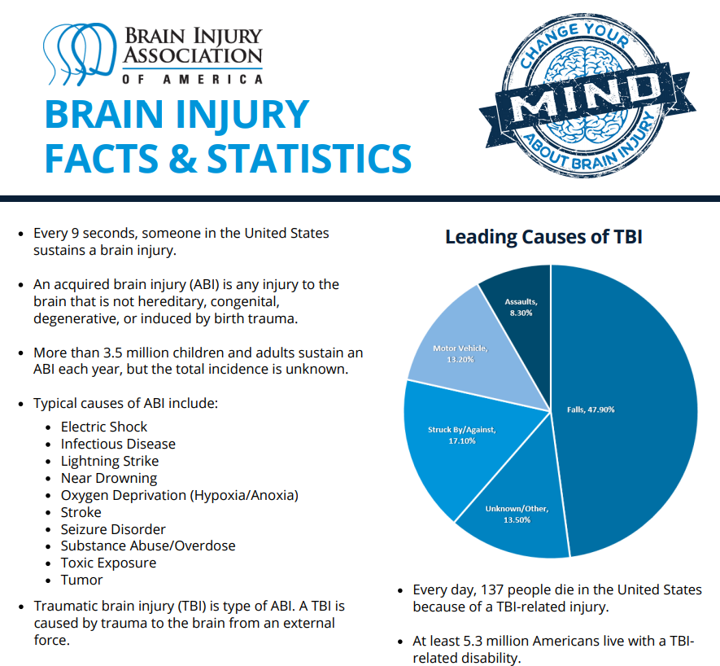

# TBI-Traumatic-Brain-Injury-EDA
## Final Capstone for the 30-Day Challenge by [Zindua School](https://zinduaschool.com)

This project involves: database design, data consolidation into an relational databse, as well as data analysis and visualisation on traumatic brain injury data. 

The project has been adopted from [#TidyTuesday](https://github.com/rfordatascience/tidytuesday) a weekly social data project organized by the R4DS Online Learning Community

# About Traumatic Brain Injury (TBI)

> Brain Injury Awareness Month, observed each March, was established 3 decades ago to educate the public about the incidence of brain injury and the needs of persons with brain injuries and their families (1). Caused by a bump, blow, or jolt to the head, or penetrating head injury, a traumatic brain injury (TBI) can lead to short- or long-term changes affecting thinking, sensation, language, or emotion.
- [CDC](https://www.cdc.gov/mmwr/volumes/68/wr/mm6810a1.htm)

The goal of this project is to spread awareness for just how common TBIs are - both in civilian and military populations. 

If you want to share an infographic or summary graphic from this data - please consider using the awareness hashtag: `#ChangeYourMind`, `#braininjuryawarenessmonth`, or tagging the [Brain Injury Association](https://twitter.com/biaamerica). More details can be found at the [Brain Injury Association Website](https://www.biausa.org/public-affairs/public-awareness/brain-injury-awareness).

### Data Dictionary

# `tbi_age.csv`

|variable         |class     |description |
|:----------------|:---------|:-----------|
|age_group        |character | Age group |
|type             |character | Type of measure |
|injury_mechanism |character | Injury mechanism |
|number_est       |double    | Estimated observed cases in 2014 |
|rate_est         |double    | Rate/100,000 in 2014 |

# `tbi_year.csv`

|variable         |class     |description |
|:----------------|:---------|:-----------|
|injury_mechanism |character | Injury mechanism |
|type             |character | Type of measure |
|year             |character | Year |
|rate_est         |double    | Rate/100,000 in 2014 |
|number_est       |integer   | Estimated observed cases in each year |

# `tbi_military.csv`

|variable  |class     |description |
|:---------|:---------|:-----------|
|service   |character | Military branch |
|component |character | Military component (active, guard, reserve) |
|severity  |character | Severity/type of TBI |
|diagnosed |double    | Number diagnosed |
|year      |integer   | Year for observation|

## Deliverables 
The following are the outcomes expected from the project: 
1. Create a logical and physical SQL Schema - Have it separate and upload it to your GitHub repo
2. Create the the Databases and the tables to contain the data - millitary, age, year - Have it separate and upload it to your GitHub repo
3. Load the data to Power BI and Perform transformations - e.g cleaning the age column, formatting datatypes 
4. Develop Power BI Visualizations 
5. Develop a Power BI - Dashboard 
6. Presentation with Insights.

### Project Collaborators
- **Dutia Ojiambo:** Enter short bio | [Github]() | [LinkedIn]()
- **Zaitun Achieng:** Enter short bio | [Github]() | [LinkedIn]()
- **Mercy Chebet:** Enter short bio | [Github]() | [LinkedIn]()

